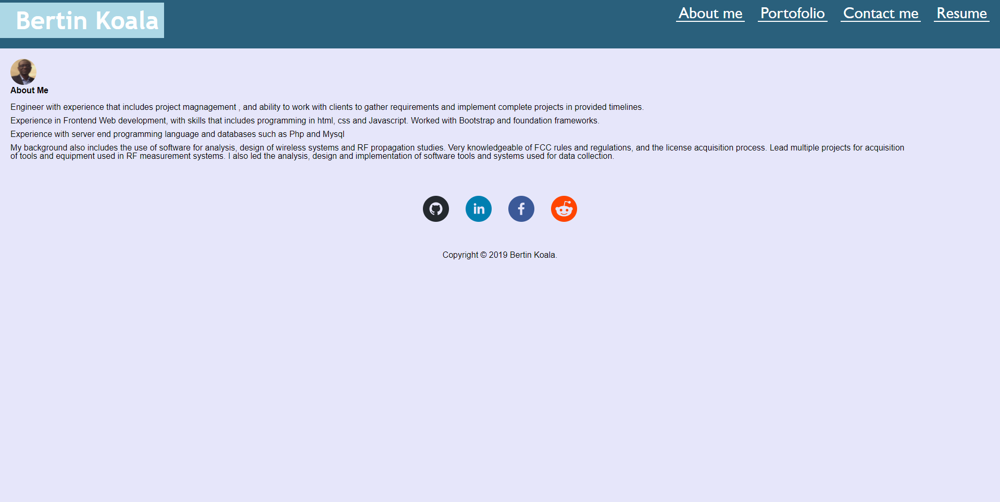

# Bk_React: React Portfolio

## Portfolio deployed 
This portofiolo was refactored using React and deployed on Github

## User Story

For employers looking for candidates with experience building single-page applications, I am deploying a  React portfolio of work samples on Github.
The page loads the application and shows a header with links that can be clicked and redirected to other contents. The usser can navigate to different pages of the portofolio.
The user can look at 6 application developped and currently deployed and accessible by clicking on links.
The contact form allow users to enter information that are validated but no action is taken with the user information.  The footer section show links to the user github profile and other social media pages.

Here are the url of the deployed githup page and screen shot of the deployed application main page.

Application Page Link :https://bkoala.github.io/Bk_React_portofolio/

Application Screen Shot : 

